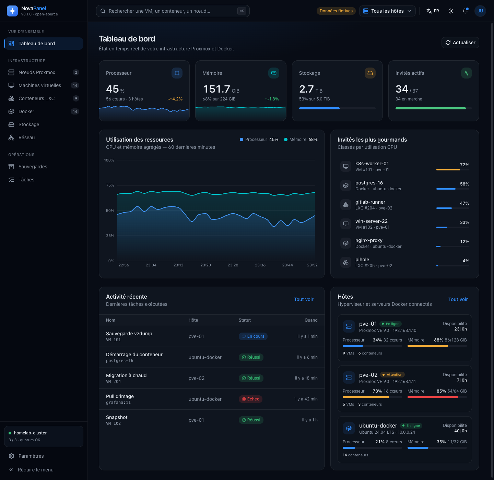
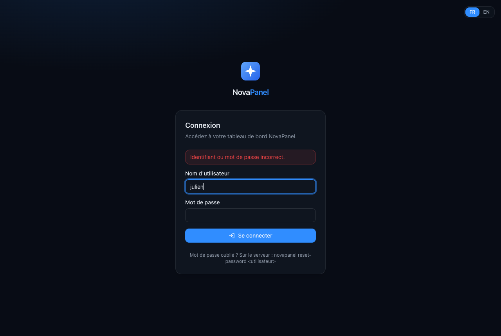

<p align="left">
  
</p>

<p align="center">
  
</p>

<h1 align="center">NovaPanel</h1>

<p align="center">
  Tableau de bord open-source pour piloter un hyperviseur <b>Proxmox VE</b> et des serveurs <b>Ubuntu / Docker</b>.<br/>
  <i>Open-source dashboard to manage a Proxmox VE hypervisor and Ubuntu / Docker servers.</i>
</p>



<p align="center"></p>

## Statut / Status

| Sprint | Contenu | État |
| --- | --- | --- |
| 1 | Fondation frontend : Vite, Tailwind v4, shadcn/ui, Layout (sidebar + header), dashboard, FR/EN, thème sombre/clair | ✅ |
| 2 | Backend FastAPI : Proxmox (`proxmoxer`, jeton API lecture seule) + Docker via SSH (`docker`, `paramiko`), dashboard branché sur l'API, mode démo automatique | ✅ |
| 3 | Authentification (Argon2id, sessions, anti-bruteforce), déploiement : `install.sh` (systemd), Docker Compose (+ HTTPS Caddy), releases GitHub | ✅ |
| 4 | Pages Nœuds, VMs, LXC, Docker (logs), Stockage, Tâches + journal ; actions démarrer/éteindre/redémarrer/forcer l'arrêt… avec confirmation ; recherche globale ⌘K | ✅ |
| 5 | Historique par hôte persistant (1 h / 24 h / 7 j), graphique « une courbe par machine » ; pages Réseau (interfaces, ponts, VLAN, réseaux Docker) et Sauvegardes (tâches planifiées, couverture, archives, sauvegarde immédiate) | ✅ |
| 6 | Snapshots (créer avec ou sans RAM, restaurer avec confirmation tapée, supprimer, vue globale des vieux snapshots) ; alertes (10 règles réglables) et notifications e-mail, Discord, Telegram, ntfy, webhook | ✅ |
| 7 | Utilisateurs et rôles : Lecteur (lecture seule), Opérateur (actions), Administrateur (comptes, alertes) ; désactivation, réinitialisation de mot de passe, garde-fous (dernier admin, soi-même) | ✅ |
| 8 | Mise à jour en un clic depuis Paramètres (installation native) : `install.sh` lancé en arrière-plan par une unité systemd, suivi du journal | ✅ |

## Stack

- **Frontend** : React 19 + Vite, TypeScript, Tailwind CSS v4, shadcn/ui (Radix), Recharts, lucide-react, React Router
- **Backend** : Python 3.11+, FastAPI, `proxmoxer`, `docker`, `paramiko`, géré avec [uv](https://docs.astral.sh/uv/)

## Installation

Deux méthodes, au choix. Les deux servent l'interface et l'API sur **un seul port (8080)**.

### A. Installation native (systemd) — Debian 12/13, Ubuntu 22.04/24.04, LXC Proxmox

```bash
curl -fsSL https://raw.githubusercontent.com/julien84120/nova-panel/main/install.sh | sudo bash
# ou depuis un clone :  git clone https://github.com/julien84120/nova-panel && cd nova-panel && sudo ./install.sh
```

Le script installe NovaPanel dans `/opt/novapanel`, crée l'utilisateur système `novapanel`,
le service `novapanel.service` (durci) et vous demande de créer le compte administrateur.

| Élément | Emplacement |
| --- | --- |
| Configuration (Proxmox, SSH, port) | `/etc/novapanel/novapanel.env` → `sudo systemctl restart novapanel` |
| Clés SSH (`config`, clé, `known_hosts`) | `/var/lib/novapanel/.ssh/` (propriétaire `novapanel`, droits 600) |
| Base (comptes, sessions) | `/var/lib/novapanel/data/novapanel.db` |
| Logs | `journalctl -u novapanel -f` |
| Mise à jour | relancer le script · `--version v0.3.0` pour une version précise |
| Désinstallation | `sudo ./install.sh --uninstall` (`--purge` efface aussi config et données) |

Tester la connexion SSH avec l'identité du service (et enregistrer l'empreinte du serveur) :

```bash
sudo -u novapanel ssh -F /var/lib/novapanel/.ssh/config nova-oracle 'docker version --format {{.Server.Version}}'
```

**Sur Proxmox**, installez NovaPanel dans un conteneur LXC plutôt que sur l'hyperviseur :

```bash
# Sur l'hôte Proxmox — adaptez l'ID (120), le stockage (local-lvm) et le pont réseau (vmbr0)
pveam update
TPL=$(pveam available --section system | awk '/debian-13-standard/ {print $2}' | tail -n1)
pveam download local "$TPL"
pct create 120 "local:vztmpl/$TPL" --hostname novapanel \
  --cores 1 --memory 512 --rootfs local-lvm:4 --net0 name=eth0,bridge=vmbr0,ip=dhcp \
  --unprivileged 1 --features nesting=1 --onboot 1 --start 1
pct exec 120 -- bash -c "apt-get update && apt-get install -y curl && curl -fsSL https://raw.githubusercontent.com/julien84120/nova-panel/main/install.sh | bash"
```

### B. Docker Compose — Ubuntu (ou tout hôte Docker)

```bash
git clone https://github.com/julien84120/nova-panel && cd nova-panel
cp backend/.env.example .env              # complétez Proxmox / SSH
cp deploy/ssh/config.example deploy/ssh/config
cp ~/.ssh/novapanel_ed25519 deploy/ssh/   # clé privée dédiée
ssh-keyscan -H 152.70.x.x > deploy/ssh/known_hosts   # vérifiez l'empreinte !
docker compose up -d --build              # → http://<ip>:8080
docker compose logs novapanel | grep -A2 jeton    # jeton du premier compte
```

Créer / réinitialiser un compte : `docker compose exec novapanel novapanel create-admin`
(ou `reset-password <utilisateur>`). Mise à jour : `git pull && docker compose up -d --build`.

**HTTPS sur le réseau local** (certificat interne Caddy) :

```bash
echo "NOVA_DOMAIN=novapanel.lan" >> .env      # nom résolu par votre DNS local / fichier hosts
echo "NOVA_LISTEN=127.0.0.1" >> .env          # le port 8080 n'est plus exposé, seul Caddy l'est
docker compose --profile https up -d --build  # → https://novapanel.lan
```

## Sécurité

- **Mots de passe** hachés en Argon2id ; 10 caractères minimum.
- **Sessions** côté serveur, cookie `HttpOnly` + `SameSite=Strict` (+ `Secure` en HTTPS) ; expiration après 7 jours ou 24 h d'inactivité ; changer de mot de passe ferme les autres sessions.
- **Anti-bruteforce** : verrouillage progressif après 5 échecs (par IP et identifiant).
- **CSRF** : en-tête `X-Nova-Request` exigé sur toute requête qui modifie l'état.
- **En-têtes** : CSP stricte, `X-Frame-Options: DENY`, `nosniff`, `no-store` sur l'API.
- **Premier compte** : créé en CLI, ou dans le navigateur avec le jeton à usage unique affiché dans les logs — personne d'autre sur le réseau ne peut « réclamer » le panneau.
- Jeton Proxmox en **lecture seule** (PVEAuditor) ; SSH avec clé dédiée et empreinte vérifiée.
- Pour un accès depuis Internet : passez par un VPN (WireGuard/Tailscale) plutôt que d'ouvrir le port.

## Développement / Development

```bash
# Terminal 1 — API (http://127.0.0.1:8000/api/docs)
cd backend
uv sync
cp .env.example .env      # puis complétez (voir ci-dessous)
uv run novapanel serve     # au 1er lancement : jeton d'installation affiché dans le terminal

# Terminal 2 — interface (http://localhost:5173, /api proxifié vers :8000)
cd frontend
npm install
npm run dev
```

Sans `.env` complété, chaque source passe automatiquement en **mode démo** (badge « Données fictives »).
Tests : `cd backend && uv run pytest` · `cd frontend && npm run lint && npm run build`.

## Configuration des sources

### 1. Proxmox VE (testé sur 9.2) — jeton API en lecture seule

Dans l'interface Proxmox :

1. **Datacenter → Permissions → Users → Add** : utilisateur `novapanel`, realm `Proxmox VE authentication server` (`pve`).
2. **Datacenter → Permissions → API Tokens → Add** : utilisateur `novapanel@pve`, Token ID `novapanel`, laissez **Privilege Separation** coché. Copiez le secret (affiché une seule fois).
3. **Datacenter → Permissions → Add → API Token Permission** : chemin `/`, token `novapanel@pve!novapanel`, rôle **`PVEAuditor`**, *Propagate* coché.

4. **Datacenter → Permissions → Add → User Permission** : chemin `/`, utilisateur `novapanel@pve`, rôle **`PVEAuditor`**, *Propagate* coché.

> Avec *Privilege Separation*, les droits effectifs du jeton sont l'**intersection** des droits du jeton
> et de ceux de son utilisateur : les **deux** doivent avoir `PVEAuditor` sur `/`, sinon Proxmox répond
> `403 Permission check failed (/nodes/<nœud>, Sys.Audit)`.

Ou en ligne de commande sur le nœud :

```bash
pveum user add novapanel@pve --comment "NovaPanel (lecture seule)"
pveum user token add novapanel@pve novapanel --privsep 1      # affiche le secret
pveum acl modify / --users novapanel@pve --roles PVEAuditor
pveum acl modify / --tokens 'novapanel@pve!novapanel' --roles PVEAuditor

# Vérification : Sys.Audit doit apparaître pour le jeton
pveum user token permissions novapanel@pve novapanel --path /nodes
```

Puis dans `backend/.env` :

```ini
PROXMOX_HOST=192.168.1.10
PROXMOX_USER=novapanel@pve
PROXMOX_TOKEN_NAME=novapanel
PROXMOX_TOKEN_SECRET=xxxxxxxx-xxxx-xxxx-xxxx-xxxxxxxxxxxx
PROXMOX_VERIFY_SSL=false   # certificat auto-signé par défaut
```

### 1 bis. Autoriser les actions (démarrer, éteindre, redémarrer…)

Les boutons d'action exigent le privilège **`VM.PowerMgmt`** ; « Sauvegarder maintenant » exige en plus
**`VM.Backup`** et **`Datastore.AllocateSpace`** (écriture sur le stockage de sauvegarde) ; les snapshots
**`VM.Snapshot`** (créer / supprimer) et **`VM.Snapshot.Rollback`** (restaurer). On l'ajoute au jeton existant via un rôle dédié,
sans retirer `PVEAuditor` (les rôles s'additionnent) :

```bash
pveum role add NovaPanelOperator --privs "VM.PowerMgmt VM.Backup VM.Snapshot VM.Snapshot.Rollback Datastore.AllocateSpace"
# (rôle déjà créé ? → pveum role modify NovaPanelOperator --privs "VM.PowerMgmt VM.Backup VM.Snapshot VM.Snapshot.Rollback Datastore.AllocateSpace")
pveum acl modify / --users novapanel@pve --roles NovaPanelOperator
pveum acl modify / --tokens 'novapanel@pve!novapanel' --roles NovaPanelOperator

# Vérification : VM.PowerMgmt doit apparaître
pveum user token permissions novapanel@pve novapanel --path /vms
```

> Pour limiter les actions à certains invités, remplacez `/` par `/vms/<vmid>` ou par un pool (`/pool/<nom>`).
> Sans ce rôle, les boutons renvoient « permission refusée » et rien n'est modifié.
> Pour masquer complètement les actions : `NOVA_ACTIONS=false` dans la configuration.

Côté Docker, les actions (démarrer, arrêter, redémarrer, pause) et les logs utilisent la même connexion SSH.
Chaque action est enregistrée dans le **journal NovaPanel** (page Tâches) : qui, quoi, quand, résultat.

### 2. Serveur Ubuntu / Docker via SSH (ex. instance Oracle Cloud)

NovaPanel utilise **un alias SSH** défini dans `~/.ssh/config` de l'utilisateur qui exécute le backend : le SDK Docker (`ssh://alias`) et la sonde de métriques (paramiko) lisent la même configuration.

```sshconfig
# ~/.ssh/config
Host nova-oracle
    HostName 152.70.x.x          # IP publique de l'instance
    User ubuntu
    IdentityFile ~/.ssh/novapanel_ed25519
    IdentitiesOnly yes
```

```bash
# Sur votre machine : clé dédiée, puis copie de la clé publique
ssh-keygen -t ed25519 -f ~/.ssh/novapanel_ed25519 -C novapanel
ssh-copy-id -i ~/.ssh/novapanel_ed25519.pub nova-oracle
ssh nova-oracle 'docker version --format {{.Server.Version}}'   # doit répondre sans mot de passe

# Sur le serveur : l'utilisateur SSH doit pouvoir parler au démon Docker
sudo usermod -aG docker ubuntu     # puis se reconnecter
```

> La première connexion `ssh nova-oracle` enregistre l'empreinte du serveur dans `known_hosts`.
> Le backend **refuse** les hôtes inconnus (pas d'acceptation automatique d'empreinte).
>
> ⚠️ Être membre du groupe `docker` équivaut à un accès root sur ce serveur : utilisez une clé dédiée et protégez-la.

Puis dans `backend/.env` :

```ini
DOCKER_SSH_HOST=nova-oracle
DOCKER_DISPLAY_NAME=oracle-docker
```

## Mise à jour depuis l'interface

Installation native (`install.sh`) : **Paramètres → Compte → Mise à jour de NovaPanel** (administrateurs).
Le service, non root, dépose simplement un fichier `update.request` ; l'unité systemd `novapanel-update.path`
le détecte et relance le script d'installation officiel en root (configuration, comptes et données conservés).
Journal : `/var/lib/novapanel/data/update.log`. Avec Docker : `docker compose pull && docker compose up -d`.

## Utilisateurs et rôles

| Rôle | Peut |
| --- | --- |
| **Lecteur** | tout consulter (tableaux de bord, VMs, Docker, sauvegardes, alertes, journal) |
| **Opérateur** | + démarrer / arrêter, sauvegarder, snapshots, acquitter les alertes |
| **Administrateur** | + gérer les comptes, les règles d'alerte et les canaux de notification |

Gestion dans **Paramètres → Utilisateurs**. Le contrôle est fait **côté serveur**, refus par défaut : toute requête
d'écriture exige au moins *Opérateur*. Changer le rôle, désactiver ou réinitialiser le mot de passe d'un compte ferme
ses sessions ouvertes. Il reste toujours au moins un administrateur actif, et personne ne peut modifier son propre
rôle ni supprimer son propre compte. Les comptes créés avant la v0.7 sont administrateurs.

## Alertes et notifications

Les règles sont évaluées à chaque collecte (10 s) : nœud hors ligne, source injoignable, CPU / mémoire élevés
(avec durée minimale), stockage presque plein (avertissement / critique), stockage indisponible, sauvegarde
vzdump en échec, conteneur Docker *unhealthy*, invités sans sauvegarde planifiée, vieux snapshots.
Une alerte est **notifiée une seule fois** à son déclenchement, puis à sa résolution (option).

Canaux (Paramètres → *Alertes et notifications*) : **e-mail SMTP**, **Discord** (webhook), **Telegram** (bot),
**ntfy** (push mobile) et **webhook JSON** (Home Assistant, n8n, Gotify…), chacun avec une gravité minimale
et un bouton *Tester*. Les secrets sont stockés dans la base locale (`novapanel.db`, droits 600) et ne sont
jamais renvoyés au navigateur ; les messages d'erreur n'incluent jamais l'URL d'un webhook.

## API

| Méthode | Route | Description |
| --- | --- | --- |
| GET | `/api/health` | État de l'API et de chaque source (`live` / `demo` / `error`) |
| GET | `/api/dashboard` | Instantané complet : résumé, hôtes, invités, tâches, historique 1 h |
| POST | `/api/dashboard/refresh` | Force une collecte immédiate |
| GET | `/api/hosts` | Nœuds Proxmox + hôtes Docker |
| GET | `/api/guests?type=qemu\|lxc\|docker&host=` | VMs, conteneurs LXC et Docker |
| GET | `/api/storages` · `/api/tasks` · `/api/audit` | Stockages, tâches Proxmox, journal des actions |
| GET | `/api/proxmox/nodes/{node}?timeframe=hour\|day\|week\|month` | Détail d'un nœud + historique RRD |
| GET | `/api/proxmox/guests/{node}/{qemu\|lxc}/{vmid}` | Détail d'un invité (config, disques, réseau, RRD) |
| POST | `/api/proxmox/guests/{node}/{qemu\|lxc}/{vmid}/{start\|shutdown\|stop\|reboot\|suspend\|resume}` | Action → UPID |
| GET | `/api/proxmox/task?node=&upid=` | Suivi d'une tâche Proxmox |
| POST | `/api/docker/containers/{id}/{start\|stop\|restart\|pause\|unpause}` | Action Docker |
| GET | `/api/docker/containers/{id}/logs?tail=200` | Logs d'un conteneur |
| GET | `/api/metrics/history?range=hour\|day\|week&host=` | Historique CPU / mémoire par hôte |
| GET | `/api/network` | Interfaces Proxmox, cartes réseau des invités, réseaux Docker |
| GET | `/api/backups` | Tâches planifiées, archives, invités non couverts |
| POST | `/api/proxmox/guests/{node}/{qemu\|lxc}/{vmid}/backup` | Sauvegarde immédiate (`{"storage": "...", "mode": "snapshot"}`) |
| GET | `/api/snapshots` | Tous les snapshots (VMs et LXC) |
| GET · POST | `/api/proxmox/guests/{node}/{qemu\|lxc}/{vmid}/snapshots` | Lister / créer (`{"name", "description", "vmstate"}`) |
| POST | `…/snapshots/{name}/rollback` | Restaurer (`{"confirm": "<name>"}` obligatoire) |
| DELETE | `…/snapshots/{name}` | Supprimer un snapshot |
| GET · POST | `/api/users` · PATCH · DELETE `/api/users/{id}` | Comptes (`{"role": "viewer\|operator\|admin", "disabled", "password"}`) — administrateurs |
| GET | `/api/alerts?state=active\|all` · POST `/api/alerts/{id}/ack` | Alertes actives / historique, acquittement |
| GET · PUT | `/api/alerts/config` | Règles et canaux de notification (secrets masqués en lecture) |
| POST | `/api/alerts/channels/{id}/test` · `/api/alerts/evaluate` | Notification de test, réévaluation immédiate |

Un collecteur en tâche de fond interroge les sources toutes les `NOVA_POLL_INTERVAL` secondes (10 par défaut) ;
les routes lisent le dernier instantané, quel que soit le nombre d'onglets ouverts.
L'historique est conservé **par hôte** dans la base locale (8 jours) : il survit aux redémarrages et
est amorcé avec les RRD Proxmox (1 h, 24 h, 7 j). Pour un hôte Docker, l'historique démarre à l'installation.

Toutes les routes sauf `/api/health` et `/api/auth/*` exigent une session. Routes d'authentification :
`GET /api/auth/status`, `POST /api/auth/setup`, `POST /api/auth/login`, `POST /api/auth/logout`, `POST /api/auth/password`.

Ajouter un composant shadcn/ui : `npx shadcn@latest add dialog` (config dans `frontend/components.json`).

## Structure

```
install.sh                   # installation native systemd
Dockerfile, docker-compose.yml
deploy/                      # service systemd, entrypoint Docker, Caddyfile, dossier ssh/
backend/
├── .env.example             # modèle de configuration (copier en .env)
├── app/
│   ├── main.py              # routes FastAPI, middleware sécurité (+ service du frontend compilé)
│   ├── auth.py / db.py      # comptes, sessions, anti-bruteforce (SQLite)
│   ├── cli.py               # commande `novapanel` (serve, create-admin, reset-password)
│   ├── collector.py         # collecte périodique + historique
│   ├── config.py            # réglages (.env)
│   ├── schemas.py           # modèles Pydantic
│   └── services/            # proxmox.py, docker_host.py, demo.py
└── tests/
frontend/
├── components.json          # config shadcn/ui
├── vite.config.ts           # alias @ → src, proxy /api → :8000
└── src/
    ├── index.css            # tokens du thème (sombre/clair)
    ├── components/
    │   ├── ui/              # composants shadcn/ui
    │   ├── brand/           # logo NovaPanel
    │   └── dashboard/       # cartes métriques, graphiques, listes
    ├── lib/api.ts           # client et types de l'API
    ├── hooks/               # AuthProvider, DashboardProvider (polling), useTheme
    ├── i18n/                # traductions FR / EN
    ├── layout/              # Layout, Sidebar, Header, navigation
    └── pages/               # Dashboard, Login, Setup, Settings, ComingSoon
```

## Licence

MIT — voir [LICENSE](LICENSE).
